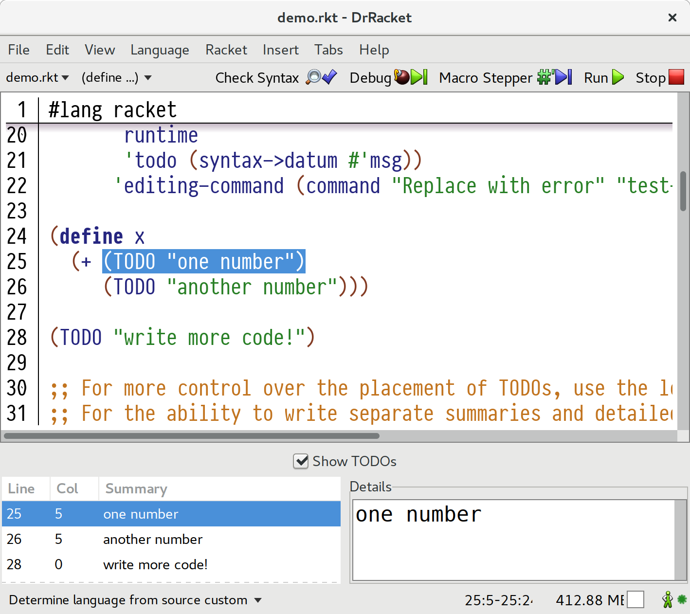

To-Do List for Macros
==========================

This Racket package contains a DrRacket tool that displays a list of the unwritten parts of a program, as determined by the macros that implement those unwritten parts, as well as providing opportunities to write the unfinished parts of the program with compiler support.

In particular, when Check Syntax finds a syntax object during expansion with the `'todo` syntax property, then it considers that syntax object to be an incomplete program. After expansion, a panel pops up with a list of tasks to be completed. When it finds an object with the `'editing-command` property mapped to a description of the editing command, then the editing commands are provided in a DrRacket right-click menu.

An editing command is an instance of the following prefab struct:
```
(struct command (name module-path function arguments) #:prefab)
```
The `name` is a string to be shown to users in a menu, the `module-path` will be loaded with `dynamic-require` to find the implementation of the command, and `function` (which must be provided by the module) will be called with `arguments`. If it returns a string, then the string is used to replace the region that was clicked on. Additionally, if `function` accepts the following keyword arguments, then they will be provided as well: `#:string` contains the string of the region on which the command was placed, `#:definitions` is the definitions window, `#:editor` is the text editor object in which the command was called, and `#:file` the path to the file being edited.

More control over both the contents of TODO items and placement of both TODO list items and editing commands is available for those with advanced needs. For more information, please consult the [docs](https://docs.racket-lang.org/todo-list/index.html).

This tool is intended for use with cooperating languages, especially statically typed languages and proof assistants. It is inspired by the hole list in the [Agda](http://wiki.portal.chalmers.se/agda/pmwiki.php) mode for Emacs as well as the ability of users to add interactive commands to Lean's interactions.

If you're interested in adding holes to your own language, then this tool is worth a try. To use it, run `rack pkg install -n todo-list` in the directory where it is checked out. Then, in DrRacket, open `demo.rkt` for a demonstration of editing commands and incomplete programs.

I'm interested in feedback from authors of languages with holes on what kinds of customization will make this tool more useful.


## Screenshots


## Thanks

The code that interacts with Check Syntax is based on [refactoring tool code from an LWC 2016 paper](https://github.com/dfeltey/lwc2016) that describes an implementation of a small Java-like language in Racket. I would like to thank Daniel Feltey, Spencer P. Florence, Tim Knutson, Vincent St-Amour, Ryan Culpepper, Matthew Flatt, Robby Findler, and Matthias Felleisen for their great demo of what is possible in Racket!
